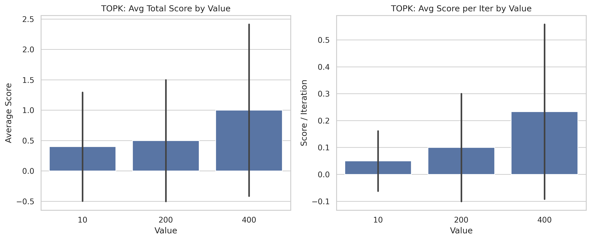
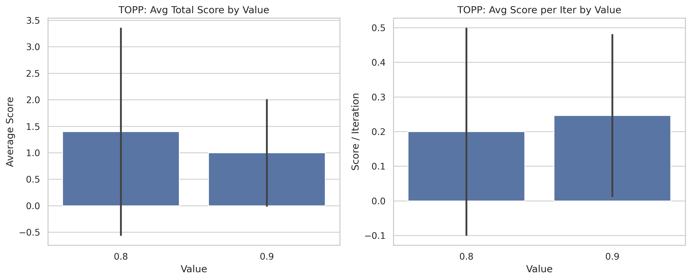
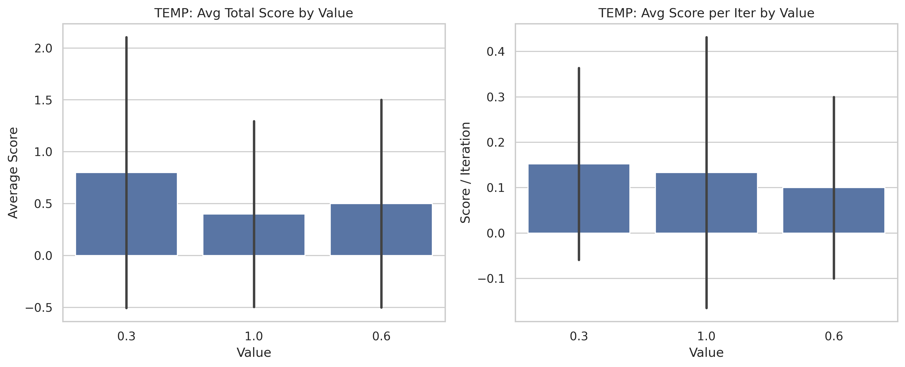
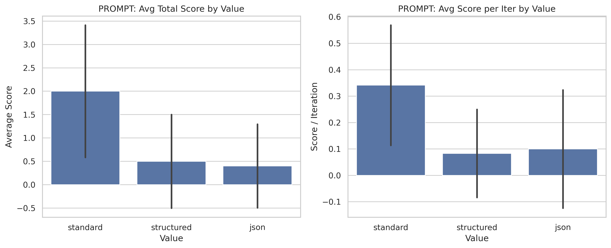

# Task 2 – Report 

## Testing script summary

I designet the script `test_combinations.py` to perform a series of experiments using different configurations of parameters. Due to limited rescources i only changed the 
parameter that i was testing and kept the rest at their default values. 

Parameters tested:
- topk (values: 10, 200, 400)
- topp (values: 0.8, 0.9)
- temp (values: 0.3, 0.6, 1.0)
- prompt (values: "standard", "structured", "json")

Test Iterations: I ran every configuration 5 times. 

Tracked Stats:
- status: Whether the test was done or timeout - checks robustness and runtime feasibility.
- score: The score achieved by the client - the amount of correct commands executed - measures effectiveness of the config. 
- iters: The number of iterations performed by the client, or 0 in case of timeout (checks the efficiency).

## Key Findings

- **Top-k Sampling**:
  - *k=400* performed best, with several successful runs and higher scores compared to k=10 and k=200.
  - *k=200* was the second best, it had lower effectiveness and timeouted once (that may just be noise).
  - *k=10* scored quite poorly.

- **Top-p Sampling**:
  - *p=0.8* very slightly outperformed *p=0.9* in score.
  - Both configs were similar, *p=0.9* had slightly better efficiency. 

- **Temperature Sampling**:
  - *temp=0.3* showed relatively better results in both score and efficiency.
  - *temp=0.6* timeouted once and scored worse.
  - *temp=1.0* performed very poorly.
  
That result is quite expected for me. I would think lower temperature causes model to be more decisive and output commands very precisely.

- **Prompting Style**:
  - *standard* prompting resulted in the highest scores.
  - *structured* and *json* prompts underperformed, often with low or zero scores.

This may have happened due to the fact that i ran my model locally and because of that it had to be quite small. That's probably why the simplest form of prompting was the best.

## Best config  

Based on the results:

- **Top-k with k=400**
- **Top-p with p=0.8** 
- Prefer **Standard prompting**.
- Avoid **temperature** above 0.3. 
