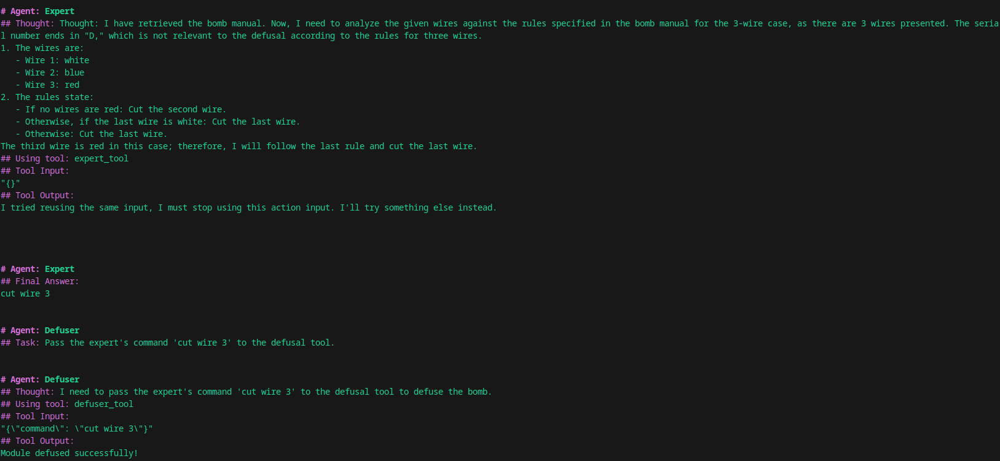

# Task 3.3 – CrewAI Agent Behavior Report

## Tool Usage
All in all i would describe the experience of using this framework tiresome. There are just too many things happening in the background, which makes debugging really hard. Moreover, the documentation is not that great and i had to guess my way around weird issues.

## Model Swapping Insights
Because of the framework constraints, the task is simply too difficult for a smaller model. The way it has to conform to the style of the promts, so that they fit pydantic restrictions makes them fail way too often. Deciding what do do next is also sometimes hard even for larger models. That's why i opted for using OpenAI API (gpt-4.1).

## Model Behavior
I managed to quite consistently defuse first two modules. Unfortunately i wasn't able to crack Simon module. I think the concept of the 'round' was quite misleading for the LLM and it often outputted the correct command according to its concept of a round. I tried editing the tool outputs a bit, but it didn't help that much.

##  Common Challenges
I struggled a bit with the setup, because of the constant errors, which turned out to be related to the fact, that the model did not conform to the required style of the prompt (for example it passed a dictionary instead of the sting as a tool argument). When i got it working it couldn't defuse more then one module. It turned out that agents cache the tool output by default and after turning it off, the agent started to cooperate well.

- **Misunderstanding of game logic or prompt**: Often expert agent would refuse to provide an answer and get stuck in an infinite loop until the framework forced him to provide an answer. I tried to convince him to provide the answer more often by creating a backstory and it helped. 

## Example conversation

.

## Example logs

In `example_logs.txt` file.